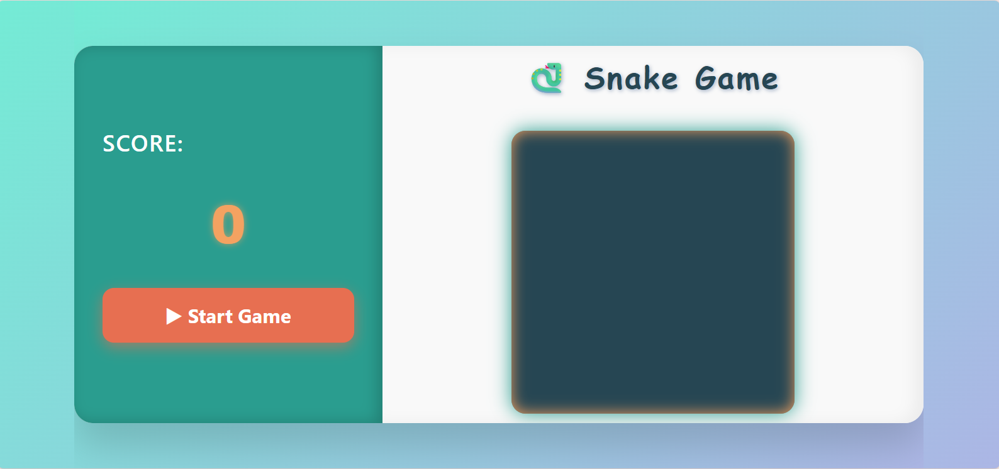
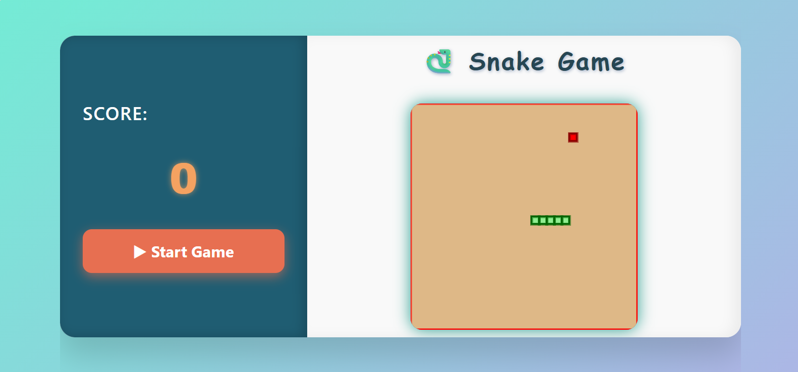
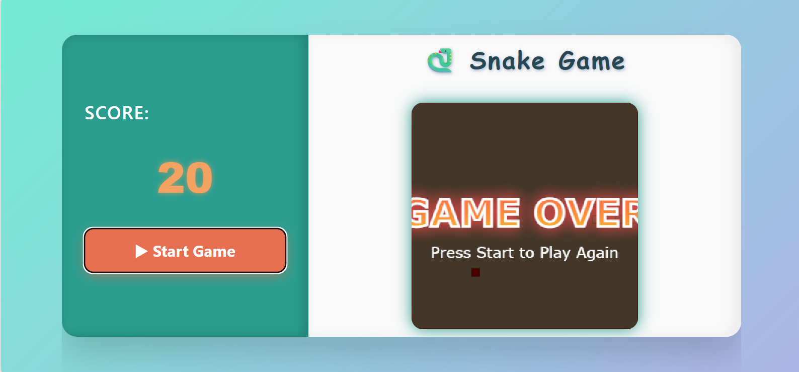

# Snake Game 🐍

  
  
  

 

---

## Demo

## Demo

Check out the live demo here:  

[▶️ Play Snake Game](https://akibashfaq.github.io/Snake-Game-With-JS/)  

## Description

Classic **Snake Game** built with **HTML5 Canvas** and vanilla **JavaScript**, styled with modern **CSS**.  
Enjoy smooth gameplay, responsive design, and interactive UI elements, wrapped in a sleek and vibrant interface.

---

## Features

- Responsive design for desktop and mobile.
- Smooth snake movement with keyboard arrow control.
- Dynamic score tracking with live update.
- Stylish game-over screen displayed on canvas.
- Easy to start and restart with a dedicated button.
- Collision detection for walls and snake itself.
- Clean, modern UI with animated button hover effects.

---

## File Layout
 
├── index.html # Main HTML file with game UI 
├── CSS 
│ └── snake.css # Styling for game layout and animations 
└── JS 
└── snake.js # JavaScript game logic and canvas rendering 
 

---

## Tech Used

- **HTML5** — Semantic markup and canvas element
- **CSS3** — Flexbox layout, animations, gradients, shadows
- **JavaScript** — Game logic, event handling, canvas drawing

## Follow this

This project was done by following the amazing tutorials from [Project Based Learning](https://github.com/practical-tutorials/project-based-learning?tab=readme-ov-file).  
Be sure to check out their repository for many other awesome project ideas and guides!

